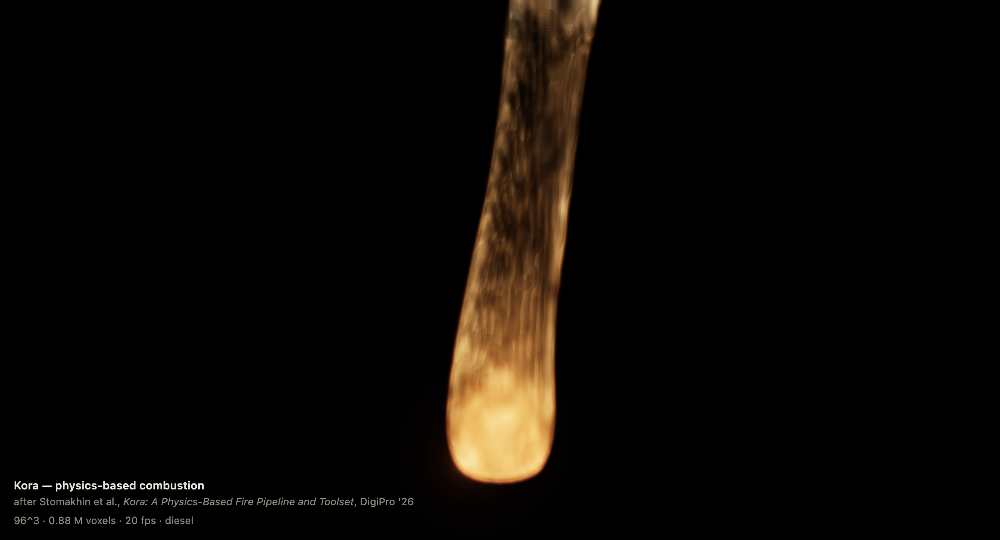
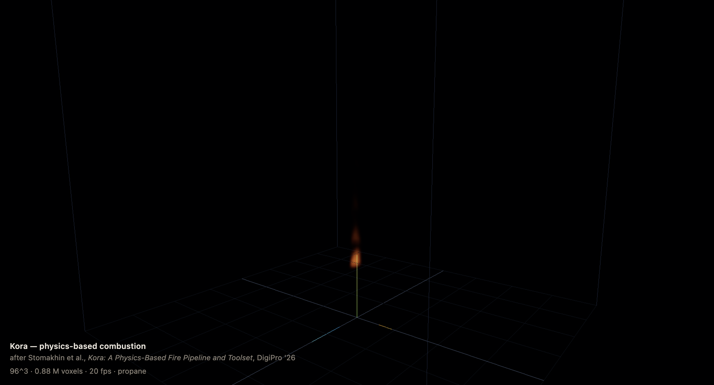

# Kora physics sandbox

A browser physics sandbox in three.js, running entirely on the GPU through WebGPU compute shaders written in TSL. It began as an implementation of the Kora combustion solver and has grown into three exhibits sharing one renderer and one WebXR stack:

- **Fire** — the combustion solver from **[Kora: A Physics-Based Fire Pipeline and Toolset](https://doi.org/10.1145/3819990.3820026)** (Stomakhin et al., Weta FX, DigiPro '26), the fire system built for *Avatar: Fire and Ash*, which won the VES 2026 Emerging Technology Award. An Eulerian grid solver with real combustion chemistry.
- **Materials** — sand, goo and water via **[MLS-MPM](https://doi.org/10.1145/3197517.3201293)** (Hu et al., SIGGRAPH 2018), a hybrid particle–grid method, with procedural water audio synthesized from simulation statistics.
- **Rigid and soft bodies** — **[Augmented Vertex Block Descent](https://graphics.cs.utah.edu/research/projects/avbd/)** (Giles, Diaz, Yuksel, SIGGRAPH 2025) running as GPU compute: stacks, cloth, ropes, springs, ragdolls, dominoes and soft bodies, up to tens of thousands of bodies.

**[Live demo](https://jameskane05.github.io/kora-fire-threejs/)** — needs a WebGPU browser. The fire is at the root; [`materials.html`](materials.html) is the sandbox with all three exhibits on a toolbar.



All three run on Apple Vision Pro in immersive VR, and in the MLS-MPM and AVBD exhibits your tracked hands are physics colliders — see [Immersive VR](#immersive-vr).

## Running it

Requires a WebGPU browser: Chrome/Edge 113+, or Safari 18+.

```bash
npm install
npm run dev
```

The dev server is HTTPS on the LAN address as well as localhost, which is there for the headset: WebXR needs a secure context, and a Vision Pro reaching this machine over the network doesn't get localhost's exemption. The certificate is self-signed, so Safari will ask you to accept it once before the VR button will do anything.

`npm run deploy` builds and force-pushes `dist` to the `gh-pages` branch. The build sets a `/kora-fire-threejs/` base path, since Pages serves a project repository from a subdirectory; the dev server stays at the root.

Known issue: `npm run typecheck` runs for many minutes and gets killed rather than reporting an error, so the build deliberately doesn't gate on it. The editor's language service checks `src` clean, so this looks like pathological inference against the large `@types/three` graph under TypeScript 7's native compiler, not a real type error.

## Fire (Kora)

The paper's central argument is that fire behaviour should *emerge from tracked chemistry* rather than from noise and hand-keyed modulation:

> Fuel-rich conditions give rise to oxygen starvation, in which combustion becomes locally oxygen-limited and flame fronts intermittently ignite and extinguish as fresh oxygen is entrained from the surrounding flow. This naturally produces visual phenomena known as choked flames, pulsation, and flickering. Because the solver tracks chemicals and models reactions explicitly, these behaviors emerge directly from the local availability of reactants rather than from heuristic noise or temporal modulation.

So this carries real molar concentrations of fuel, oxygen, nitrogen and combustion products through every voxel, burns them against a stoichiometric limit, and lets the flicker fall out of the chemistry. With the propane torch preset the flame settles at 2200–2700 K, which is propane's adiabatic flame temperature — not a number that was dialled in anywhere.

### There are no particles

This is the thing most worth understanding, and it surprises people.

There are two ways to simulate a fluid. The **Lagrangian** approach uses particles that carry properties like temperature and velocity and physically move through space. The **Eulerian** approach fixes a grid in space and lets fluid flow *through* stationary cells — nothing moves, and what changes is the numbers stored in each cell. Kora is Eulerian, and so is this. There is not one particle anywhere in the fire solver. (The MLS-MPM exhibit is the counterpoint: it's a hybrid of both approaches, and the contrast between the two is half the point of putting them side by side.)

The status readout says `96^3 · 0.88 M voxels`. That's a 96×96×96 lattice of 884,736 fixed cells filling a 2 m box, so each voxel is a cube roughly 2 cm on a side. That 2 cm is a hard floor on detail: no feature smaller than a voxel can exist. It's precisely why the paper's energy cascade turbulence is needed — it injects swirl to *suggest* structure below grid scale that the grid cannot itself resolve.

Each voxel holds eleven numbers across three RGBA 3D textures:

| Field | Channels |
| --- | --- |
| `chem` | fuel, oxygen, nitrogen, products (molar concentrations) |
| `aux` | soot, temperature (K), released heat, flame-front distance |
| `vel` | velocity u, v, w |

Each is double-buffered, because WebGPU won't let one compute shader read and write the same texture: a pass reads one copy and writes the other, then they swap. With pressure, divergence and expansion, the core state is about 57 MB of GPU memory.

**Motion without particles** comes from semi-Lagrangian advection, which is confusingly named. Each frame, for every voxel, the solver traces *backwards* along the velocity field to ask "where was the material that's now in me, one timestep ago?" and samples there. It's a backward lookup discarded immediately, with no persistence — see `trace()` in [`advection.ts`](src/sim/passes/advection.ts).

**Velocity lives on faces, not centres.** The x-component sits on the face between a cell and its neighbour in x, and so on. On this staggered (MAC) grid, divergence and pressure gradients become exact differences between adjacent samples instead of wide averages, which is the difference between a stable pressure solve and one that oscillates.

**Nothing is rendered as geometry.** The scene contains exactly one object for the fire: a cube of twelve triangles bounding the domain. The fragment shader takes each pixel that cube covers, casts a ray, and walks it through the 3D textures in up to 160 steps, accumulating emission from the blackbody temperature and opacity from soot and flame. The flame you see is that accumulation — no mesh, no surface, no sprites.

**The flame front is also just a field.** It's a signed distance stored per voxel, negative inside the reaction zone and positive outside, and combustion fires wherever it is at or below zero. The flame's "surface" is implied by the zero crossing and is never explicitly constructed.

Fire suits a grid because the physics is mostly spatial derivatives. Enforcing the ideal gas law means computing divergence; buoyancy means solving a pressure Poisson equation across neighbours; diffusion means averaging with adjacent cells. All natural on a lattice, all awkward with particles.

### Paper sections mapped to code

The solver follows Algorithm 1 of the paper, one pass per step, orchestrated in [`KoraSolver.ts`](src/sim/KoraSolver.ts).

| Paper | Code |
| --- | --- |
| §4.3.1 mixture thermodynamics, eq. (15) | [`mixture.ts`](src/sim/mixture.ts) |
| §4.3 / §4.4 expansion, ideal gas constraint, adiabatic cooling | [`expansion.ts`](src/sim/passes/expansion.ts) |
| §4.5.1 combustion, soot formation and oxidation, eq. (21) | [`combustion.ts`](src/sim/passes/combustion.ts) |
| §4.5.2 flame-front SDF and propagation, eq. (22) | [`flameFront.ts`](src/sim/passes/flameFront.ts) |
| §4.7.1 variable-density pressure projection | [`projection.ts`](src/sim/passes/projection.ts) |
| §4.7.2 mass diffusion and thermal conduction | [`diffusion.ts`](src/sim/passes/diffusion.ts) |
| §4.7.3 semi-Lagrangian and MacCormack advection | [`advection.ts`](src/sim/passes/advection.ts) |
| §4.7.4 radiative cooling | [`radiativeCooling.ts`](src/sim/passes/radiativeCooling.ts) |
| §4.7.5 dissipation, eq. (28) | [`sourcing.ts`](src/sim/passes/sourcing.ts) |
| §4.8 energy cascade turbulence, eq. (30) | [`turbulence.ts`](src/sim/passes/turbulence.ts) |
| §5.1 premixed fuel sourcing and volumetric stamping | [`sourcing.ts`](src/sim/passes/sourcing.ts) |
| §5.3.1 warped gravity and truncated Coriolis, eq. (36) | [`forces.ts`](src/sim/passes/forces.ts) |
| §5.3.2 frequency-domain guiding, eq. (38) | [`guiding.ts`](src/sim/passes/guiding.ts) |
| §5.4.1 blackbody flame colour, hollow flame, eq. (41) | [`VolumeRenderer.ts`](src/render/VolumeRenderer.ts) |
| §5.4.2 Kora diffusion and crust | [`VolumeRenderer.ts`](src/render/VolumeRenderer.ts) |
| §6 production setups | [`presets.ts`](src/ui/presets.ts) |
| *(not in the paper)* solid displacement volumes | [`solids.ts`](src/sim/passes/solids.ts), [`obstacles.ts`](src/sim/obstacles.ts) |

Physical constants and the fuel database are in [`constants.ts`](src/sim/constants.ts). The controls are grouped the way the paper groups its toolset — sourcing, simulation control, art direction, rendering — because §5.2 argues the value is as much in *which* parameters get exposed as in the solver behind them.

### Displacement volumes

Not from the paper — Kora inherits collision objects from the host framework rather than describing them — but a fire that ignores the set isn't much use. One sphere is in the plume by default; add more from the *Displacement volumes* folder and drag them with the transform gizmo (`W` translate, `E` rotate, `R` scale, `Esc` deselect, click to pick). In a headset you pinch them directly — see [What a pinch does](#what-a-pinch-does).

They're not painted on. A solid enters the solve as a boundary condition in the pressure projection:

- every primitive is a **rounded box**, which with zero half-extents is a sphere and with extents along one axis a capsule, so one SDF covers all three shapes with no branching
- the gizmo's scale is applied to the *sample point* rather than to the shape's extents, so all three axes are independent and a stretched sphere is a real ellipsoid in the solve. Scaling the extents cannot work here: a sphere is extents of zero with all of its size in the rounding radius, which is a scalar, so no amount of per-axis scaling would deform it. Dividing the point through instead makes the result no longer a true distance — it over-estimates along a stretched axis — so it's brought back by the smallest scale factor, which is enough because every consumer only tests the sign and the zero level set is exact
- once a frame they're rasterised into a `(solid velocity, signed distance)` grid, in [`solids.ts`](src/sim/passes/solids.ts) — analytic shapes could be evaluated in place, but they're needed in four different passes and the Poisson stencil alone would want seven evaluations per voxel
- a MAC face touching a solid cell gets **no pressure coupling** in the Poisson stencil, exactly like the wind inflow faces already did. That's the entire mechanism: the solve can only satisfy the divergence constraint by routing fluid around the obstacle
- face velocities are pinned to the solid's own velocity before the divergence is taken, so the projection sees a *moving* obstacle as boundary flux. Drag one through the plume and it shoves the fire rather than merely blocking it
- the raymarch terminates where the distance goes negative, so an obstacle occludes the fire behind it while fire in front still composites over

The primitives are unrolled into the kernels at build time rather than looped over, so adding or removing one recompiles the graph and a scene with none pays nothing at all. Moving, turning and resizing are uniform writes and are free. One obstacle costs about 1.1 ms of a 23 ms frame at 96³ on an M3 Air, most of it the extra fetches in the Poisson coefficients and the gradient rather than the bake itself, which is 0.15 ms.

Solid cells are decoupled whole rather than by sub-voxel fraction: a face counts as solid when either cell it separates is, which rounds the obstacle out to cell boundaries but leaves no half-buried cells still coupled through the pressure. They're also reset to still air each frame, since advection and diffusion aren't boundary-aware and would otherwise let heat seep in and glow inside the solid.

### How this differs from production Kora

Kora proper is "a weakly compressible, sparse, spatially adaptive, MPI-distributed physics-based combustion solver" running on a render farm. This is a dense grid in one browser tab, so the differences are substantial and worth being honest about.

The grid here is dense and uniform rather than sparse and spatially adaptive, so memory is spent on empty air and resolution is uniform where Kora refines near the flame. There's no MPI distribution, no liquid-gas coupling or vaporization, and no Houdini integration. The pressure projection is a fixed number of Jacobi iterations rather than a converged solve, so it's formulated in terms of deviation from hydrostatic equilibrium to keep buoyancy correct regardless of convergence. Rendering is single-scattering raymarching rather than Manuka's spectral path tracing. The eq. (30) turbulence filter defaults to an à-trous approximation, with the exact form available as a toggle.

### Performance

The frame is almost entirely solver. On an M3 Air at 96³ the simulation is ~94% of it and the raymarcher under 3%, which is the opposite of what you might expect from a volume renderer and worth knowing before optimising the wrong thing.

There's a GPU profiler built in. It attributes time per pass using WebGPU timestamp queries, submitting each pass as its own compute group for the duration of a run, and separately measures each stage by ablation on the batched path the app really uses — run the frame, run it again without the stage, take the difference:

```js
await kora.profile()  // stage budget, then solver passes grouped and individual
```

Two findings from it paid for themselves immediately, both without any change to the maths:

- **The pressure solve was recomputing its own coefficients.** Every Jacobi sweep evaluated the full mixture density of a cell and its six neighbours, but density is fixed for the whole projection. Caching the face weights, the boundary mask and the Neumann wind faces into two textures once per frame turned a sweep from 1.11 ms into 0.31 ms.
- **Curl noise was being differenced live.** Six trilinear fetches per band per voxel, twenty-four at the default band count, to take a curl of a static potential. Baking the curl into the noise volume makes it one fetch: 4.36 ms to 1.13 ms.

Together those took the frame from 47 ms to 18.6 ms — 21 fps to 54 fps — at identical quality.

Past that, cost is traded for quality through the `quality` control, which is deliberately separate from the preset: a preset says what the fire *is*, a tier says what it may cost. Measured on the same machine and scene:

| tier | grid | Jacobi | frame | fps |
| --- | --- | --- | --- | --- |
| ultra | 128³ | 32 | 49.7 ms | 20 |
| high | 96³ | 24 | 18.9 ms | 53 |
| balanced | 80³ | 12 | 8.5 ms | 117 |
| performance | 64³ | 8 | 3.3 ms | 305 |

The tiers move grid resolution and Jacobi iterations first because that is where the measurement pointed; raymarch steps barely move until the lowest tier, since cutting them buys almost nothing here and costs banding. At `performance` the plume is visibly softer and loses its finest wisps, but it is still recognisably the same fire, and a 3 ms frame leaves room for a game to do everything else.

### Diagnostics

Field statistics can be read back from the GPU at any time, which is how the physics above was verified. In the browser console:

```js
await kora.probe()        // min/max/NaN per field, as a table
kora.setDebugView('heat') // max-intensity projection of one channel
kora.setQuality('balanced')
await kora.advance(120)   // step without requestAnimationFrame, for headless checks
kora.findBadPass()        // dispatch each pass alone, name any that fails to compile
kora.gpuErrors()          // deduplicated WebGPU errors
```

The debug views step through the shading chain — `temperature`, `heat`, `soot`, `equivalence`, then `flameAlpha`, `blackbody`, `emission` — so a black frame can be attributed to a specific link rather than guessed at.



## Materials (MLS-MPM)

The **MLS** mode on the [`materials.html`](materials.html) toolbar is a 3D Moving Least Squares Material Point Method solver ([Hu et al. 2018](https://doi.org/10.1145/3197517.3201293)) — the hybrid counterpart to the fire's pure grid: particles carry mass and momentum, a background grid does the momentum exchange, and the constitutive model decides whether the same machinery behaves as **sand**, **goo** or **water**. The solver lives in [`MlsMpm.ts`](src/materials/MlsMpm.ts) with the grid transfer kernels in [`mpm3d.wgsl`](src/materials/shaders/mpm3d.wgsl); goo is rendered as a screen-space particle surface rather than raw points.

Water gets sound. A compute pass reduces the particle velocity buffer into cheap motion aggregates, and a WebAudio graph drives a filtered-noise water bed plus Minnaert-resonance bubble plinks from those aggregates and the hand-collider forces — no sample banks involved. The design is written up in [`docs/procedural-water-audio.md`](docs/procedural-water-audio.md).

In a headset, tracked hands become colliders in the material domain, so you can plough through sand or cup water. `?bench=1` (or `koraRunBench()`) times MLS goo against the AVBD gel-cut scene.

## Rigid and soft bodies (AVBD)

The **AVBD** mode is [Augmented Vertex Block Descent](https://graphics.cs.utah.edu/research/projects/avbd/) (Giles, Diaz, Yuksel, SIGGRAPH 2025) as a fully GPU-resident solver — broadphase, contact generation, constraint solve and integration are all WebGPU compute, vendored from Jure Triglav's MIT-licensed [webphysics](https://github.com/jure/webphysics) (see [`NOTICE.md`](src/materials/webphysics/NOTICE.md)) and adapted to this app's TSL stack. The broadphase is a GPU LBVH rebuilt every frame over a radix / OneSweep sort. Scenes cover stacks and pyramids, bridges, cloth on boxes, ropes, springs, Newton's cradles, dominoes, ragdolls, soft-body lattices (including a bunny), and coliseum stress tests up to 64k bodies.

Desktop controls in the stack scenes follow webphysics: click to lock the pointer, WASD to fly, left mouse to shoot a box, R to reset. The **gel-cut** scene is the crossover exhibit — a soft gel the Kora hand colliders can slice — and keeps orbit controls. A CPU TypeScript port of Chris Giles' reference implementation ([`src/materials/avbd/`](src/materials/avbd)) is available behind `?avbdCpu=1`.

In immersive mode the scenes are framed at hand scale, boxes can be grabbed and thrown with transient-pointer (gaze) selection, and tracked hand bones become swept kinematic colliders: each bone is fed into the solver with its finite-difference velocity rather than teleported per frame, so contacts see real hand motion — impulses, friction drag, and far less tunneling on fast swipes.

Getting this running on Vision Pro uncovered a WebKit WGSL compiler bug: stores to a function-scope array inside a loop are lost when the loop body also contains two dynamic-bound inner loops and a nested `array<array<f32, 6>, 6>` — which is exactly the shape of an LDL factorization. The solver's 6×6 matrices are flattened to `array<f32, 36>` to work around it; a minimal reproduction and write-up live in [`docs/webkit-wgsl-bug/`](docs/webkit-wgsl-bug).

## Immersive VR

There's an **Enter VR** button on headsets that can run it, for the fire and the materials sandbox both. On Apple Vision Pro (visionOS developer beta with the WebXR/WebGPU binding) the fire runs in the `performance` tier after the three.js pins below.

### Vision Pro + three.js WebGPU XR

Getting a `WebGPURenderer` immersive session upright on visionOS currently takes more than stock npm three. What this repo does:

1. **Platform** — visionOS with `XRGPUBinding` / the `webgpu` session feature (Safari in the headset). Serve over HTTPS on the LAN; accept the self-signed cert once before Enter VR will work.
2. **three.js pin** — npm `three@0.185.1` still disables WebGPU XR MSAA and always blit-resolves through an intermediate target. This project pins three to the [#34120](https://github.com/mrdoob/three.js/pull/34120) merge (WebGPU XR MSAA) and, in `postinstall` via [`scripts/build-three.mjs`](scripts/build-three.mjs), applies open [#34153](https://github.com/mrdoob/three.js/pull/34153) (single-pass output into the projection layer) then rebuilds `build/`. Without single-pass, visionOS tends to apply foveation to the blit rather than the scene and the stereo image warps badly toward the centre.
3. **Session setup**
   - set `renderer.xr.enabled = true` **before** `renderer.init()` (`xrCompatible` is requested then)
   - `navigator.xr.requestSession('immersive-vr', { requiredFeatures: ['webgpu'], … })`
   - after `setSession`, call `renderer.xr.setFoveation(0)` — three defaults to `1`, and Ada/Rik noted foveation can be applied twice; on visionOS that reads as heavy centre warp
4. **Budget** — stereo volume raymarching at headset resolution is the limiter. This app steps quality down to `performance`, caps raymarch steps, warms up with cheap frames before enabling the solver, skips sparks/bloom in-session, and advances the sim every other frame. `/cube.html` is a bare WebGPU XR smoke test if you need to separate three/WebKit from the fire.

Earlier visionOS plumbing notes (layer size `0×0`, viewport vs attachment mismatch, etc.) live in [docs/visionos-webgpu-webxr.md](docs/visionos-webgpu-webxr.md).

The button stays hidden where immersive VR isn't offered at all, but says so explicitly on a browser that has WebXR without the WebGPU binding — that's the difference between an out-of-date visionOS and a bug, and it is not otherwise visible from inside a headset.

Navigation is object-centric. The viewer's rig never moves; the domain is placed a metre and a bit in front of you, scaled so every preset frames the same way, and **pinch and drag to turn it**. On visionOS a pinch arrives as a `transient-pointer` input source that exists only for the duration of the gesture. Its ray is anchored near the shoulder and passes through the pinching hand, so moving that hand changes both where the ray starts and where it points; rather than guess which signal dominates, both are summed, which also makes controllers and gaze work unchanged. Release and it coasts to a stop, and catching it stops it dead. Release velocity is smoothed across frames and capped, because hand tracking drops poses and one long frame reporting an implausible speed will otherwise throw the domain through several turns.

### What a pinch does

A pinch has three possible meanings, and which one it has is decided **once, from where it was aimed at the moment it started**:

- aimed at a **mode button** — switches what a drag does, without starting one
- aimed at a **displacement volume** — that primitive is grabbed and the domain stays still under it
- aimed at **anything else** — turns the whole domain, as before

The pick is a raycast along the transient pointer's target ray. On visionOS that ray is constructed to pass through whatever you were looking at when you pinched, so aiming it *is* gaze selection — without asking for eye tracking, which the platform will not hand over anyway. On a headset with controllers the same ray is just where the controller points and the behaviour is identical.

Committing to one meaning up front matters. Re-deciding each frame on a hand ray that inevitably wanders would have the domain lurch every time the pointer clipped the edge of an obstacle mid-drag.

Mode lives on a small three-button strip (**move / turn / size**) floating below the domain in reference space, because neither of the desktop affordances survives a headset: there's no keyboard for `W`/`E`/`R`, and a gizmo made of thin axis handles is miserable to hit with a hand ray. The desktop gizmo is detached on entry and restored on exit; the selection highlight stays either way. All three routes into a mode change — panel, keys, button strip — go through one place, so they can't disagree.

All three modes work from the same two signals, since a transient pointer is all there is: **move** carries the primitive at the depth it was picked at, **turn** applies the pointer's orientation delta, and **size** reads how far the hand has pushed along the ray it started on. Size deliberately ignores the ray's *current* direction — coupling scale to aim means the object swells every time you glance off to one side. All of it is computed in world space and converted back through the object's parent, since the primitives hang off a rig that is both scaled and rotated.

Scaling in a headset is uniform only; one hand ray has no way to say *which* axis. Per-axis stretching is a desktop affair, via the gizmo's individual scale handles.

### Hands

Hand tracking is on, and your hands are drawn as a rigged mesh rather than as joint spheres. The model is the reference hand from `@webxr-input-profiles/assets` — the one three's `XRHandModelFactory` expects — vendored into `public/hands/` instead of pulled from the CDN three defaults to, so it loads on a local network. WebXR reports twenty-five joints per hand and three poses the glTF skeleton from them each frame.

The asset ships with an opaque skin material, which is wrong here twice over: this scene has no lights, so a lit material renders black, and solid hands in front of a volumetric fire hide the thing you came to look at. It's replaced with an unlit fresnel shell — about 5% opacity face-on rising to 85% at grazing angles — so what you see is a glass outline you can watch the fire through. The tint is cool against the fire's orange, so a hand in front of a flame stays legible.

Two details that aren't obvious:

- **The wrist fade.** The model stops at the wrist in a hard open ring, which reads as a severed hand. It's dissolved over the 20–100 mm around the tracked wrist joint. That has to key off world-space distance rather than anything in the mesh, because the geometry is skinned and its bind-pose coordinates no longer say where a vertex ended up — but `positionWorld` does follow the skinning, since three's `setupPosition` runs `skinning()` into `positionLocal` first.
- **Draw order.** Neither the hands nor the volume write depth, so which appears in front is decided by draw order alone. The volume renders at 10 and the hands at 20, which means you can always see where your hands are even when they're inside the fire; because the shell is mostly transparent the flame still shows through, so it reads as the hand being lit from within rather than as it floating in front of something it should be inside.

`kora.previewHand()` drops one into the desktop scene in its rest pose, wearing the same material — the shader is otherwise impossible to iterate on without putting a headset on.

Two things are given up inside a session. Bloom is skipped, since the pass composites through a screen-space render target that the per-eye array texture won't take, so the fire loses its glow. And the quality tier is stepped down to `performance` for the duration and restored on exit: three currently disables multiview for WebGPU XR, so the volume is raymarched twice per frame at headset resolution, and a fire that judders is worse than one with less detail. Each tier also carries an `xrScale`, the fraction of the compositor's recommended eye resolution to actually render — the recommendation on a Vision Pro is 4851×3887 per eye, which is far more raymarching than the device can carry.

## Credits

The science is from the papers; please cite them, not this repository.

Fire:

> Alexey Stomakhin, John Edholm, Murali Ramachari, Aleksandr Isakov, Zahra Forootaninia, Marcus Schoo, Nicholas Illingworth, and Joe Letteri. 2026. *Kora: A Physics-Based Fire Pipeline and Toolset.* In Proceedings of DigiPro '26. https://doi.org/10.1145/3819990.3820026

The paper is licensed CC BY-NC-ND 4.0. *Kora* is te reo Māori for *spark*.

Materials: Yuanming Hu, Yu Fang, Ziheng Ge, Ziyin Qu, Yixin Zhu, Andre Pradhana, and Chenfanfu Jiang. 2018. *A Moving Least Squares Material Point Method with Displacement Discontinuity and Two-Way Rigid Body Coupling.* SIGGRAPH 2018. https://doi.org/10.1145/3197517.3201293

Rigid bodies: Chris Giles, Elie Diaz, and Cem Yuksel. 2025. *Augmented Vertex Block Descent.* SIGGRAPH 2025. The GPU implementation is vendored from Jure Triglav's [webphysics](https://github.com/jure/webphysics) (MIT); the CPU port follows Chris Giles' [reference implementation](https://graphics.cs.utah.edu/research/projects/avbd/) (MIT); the GPU radix sort is based on Thomas Smith's GPUSorting (MIT). See the `NOTICE.md` files under [`src/materials/`](src/materials).

The backdrops in `public/env/` are CC0 from [Poly Haven](https://polyhaven.com/). The hand mesh in `public/hands/` is the reference model from [`@webxr-input-profiles/assets`](https://github.com/immersive-web/webxr-input-profiles) (Apache-2.0).
